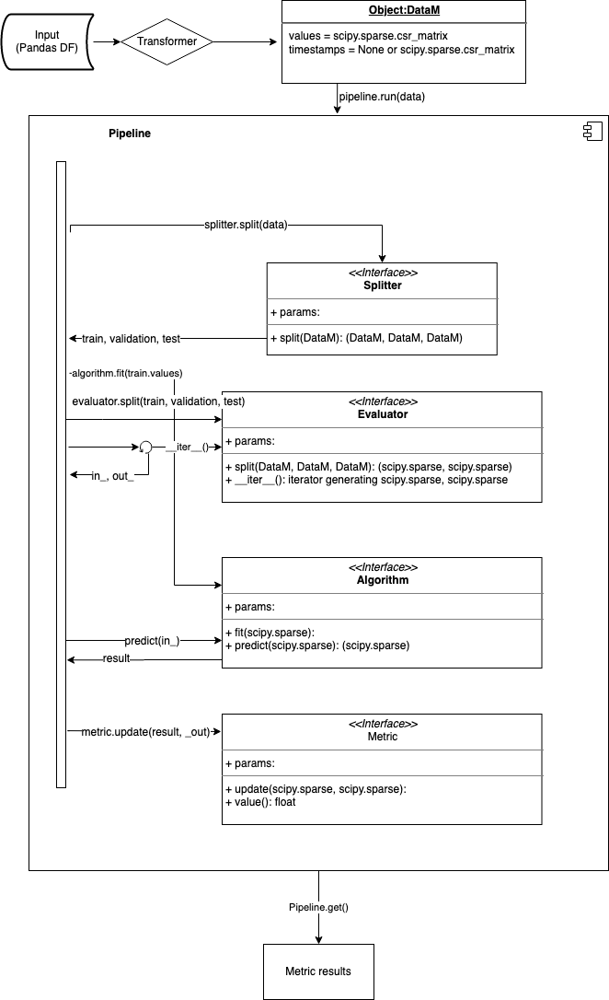

# recpack
Python package for easy experimentation with recsys algorithms

## Installation

1. Clone repository
2. In repository run `pip install .`

## Usage
Recpack can be used as a repository of algorithms in which case you should use just the algorithms module.
We also provide a pipeline to make testing algorithms easy. When using a pipeline you go through following steps

### Load data
Data is expected to be loaded into a pandas df.
Then helper functions can be used to clean it up and turn it into an internal representation.

```python
from recpack.data_matrix import DataM
import pandas as pd

# Load data from CSV (assumes you have the data stored in the path provided)
dataframe = pd.read_csv(
    'datasets/ML_100K/u.data'
)

# clean up data
# This is to create a continuous user and item space.
# Which makes training faster and avoids unneeded 0 rows or collumns
item_ids = list(dataframe['movieId'].unique())
user_ids = list(dataframe['userId'].unique())
item_id_mapping = recpack.preprocessing.helpers.rescale_id_space(item_ids)
user_id_mapping = recpack.preprocessing.helpers.rescale_id_space(user_ids)

dataframe['iid'] = dataframe['movieId'].map(lambda x: item_id_mapping[x])
dataframe['uid'] = dataframe['userId'].map(lambda x: user_id_mapping[x])

# Drop the non continuous id columns (not really necessary, but frees up space)
df = dataframe.drop(['userId', 'itemId'], axis=1)
# Convert data into internal representation
data = DataM.create_from_dataframe(df, 'iid', 'uid', 'timestamp')
```

### Select algorithms
Recpack provides a set of algorithms to use in pipelines.
To get the list of all algorithms use:
```python
import recpack.algorithms
recpack.algorithms.algorithm_registry.list()
```
This will give you a list of algorithm you can use.

To create an algorithm instance use:
```python
algo = recpack.algorithms.algorithm_registry.get('ease')()
```
You can add parameters in the constructor. For information on which parameters can be used for which algorithm see the docs.

#### Implementing a new algorithm
Should you want to implement a new algorithm which we do not yet support you should create a subclass of the `Algorithm` base class

Here is the code for a popularity algorithm

```python
from recpack.algorithms.algorithm_base import Algorithm
from collections import Counter

import numpy as np

class Popularity(Algorithm):

    def __init__(self, K=200):
        self.sorted_scores = None
        self.K = K

    def fit(self, X):
        items = list(X.nonzero()[1])
        self.sorted_scores = Counter(items).most_common()

    def predict(self, X):
        """For each user predict the K most popular items"""
        score_list = np.zeros((X.shape[1]))
        for i, s in self.sorted_scores[:self.K]:
            score_list[i] = s
        return np.repeat([score_list], X.shape[0], axis=0)

    @property
    def name(self):
        return f"popularity_{self.K}"
```

### Selecting a splitter
The splitter class will take the input data and split it into 3 data objects:
* train
* validation
* test

These will be used further in the pipeline to train models, and evaluate the models.

```python
import recpack.splits
# Construct a splitter object which uses strong generalization to split the data into
# three data objects. Train will contain 50% of the users, validation 20% and test 30%
# The seed parameter is useful for creating reproducible results.
splitter = recpack.splits.StrongGeneralizationSplit(0.5, 0.2, seed=42)
```

### Selecting an evaluator
The evaluator class takes the 3 data objects and generate in and output matrices.
The input matrix will be passed as input to the predict method of the algorithm, the out matrix is the true output and will be used by the metrics.

```python
import recpack.evaluate
# Construct a fold in evaluator.
# this evaluator will take the test data, and for each user add 40% of their interactions
# to the in_ matrix and 60% to the out_ matrix.
# Seed again for reproducability.
evaluator = recpack.evaluate.FoldInPercentageEvaluator(0.4, seed=42)
```

### Creating the pipeline
When creating the pipeline you will connect all the components and select metrics which the pipeline will compute.
For the metrics we support three at the moment: `NDCG`, `Recall`, `MRR`. Each of these will be computed for each K value passed in the K_values list parameter.

```python
import recpack.pipelines
# Construct a pipeline which computes NDCG and Recall @ 10, 20, 50 and 100
# Only a single algorithm is evaluated, but you could select multiple algorithms to be evaluated at the same time.
p = recpack.pipelines.Pipeline(splitter, [algo], evaluator, ['NDCG', 'Recall'], [10,20,50,100])

# Get the metric results.
# This will be a dict with the results of the run.
p.get()
```

## More information on the pipeline

