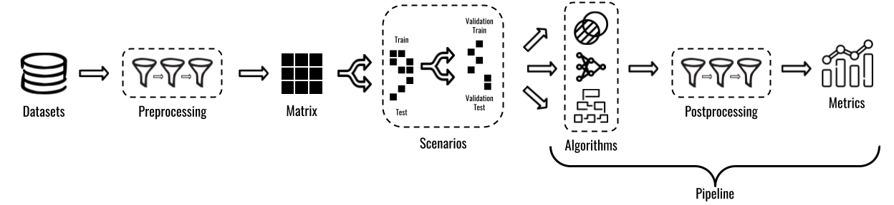

Welcome to Recpack's documentation!
===================================

RecPack is an experimentation toolkit for top-N recommendation using implicit feedback data written in Python, with a familiar interface and clear documentation.
Its goals is to support researchers who advance the state-of-the-art in top-N recommendation to write reproducible and reusable experiments.
RecPack comes with a range of different datasets, recommendation scenarios, state-of-the-art baselines and metrics.
Wherever possible, RecPack sets sensible defaults. For example, hyperparameters of all recommendation algorithms included in RecPack are initialized to the best performing settings found in the original experiments.
The design of RecPack is heavily inspired by the interface of scikit-learn, a popular Python package for classification, regression and clustering tasks. 
Data scientists who are familiar with scikit-learn will already have an intuitive understanding of how to work with RecPack.
On top of this, RecPack was developed with a production mindset: All contributions are rigorously reviewed and tested.
The RecPack maintainers strive to maintain a test coverage of more than ninety percent at all times.

Using RecPack, you can:

* **Quickly implement new algorithms** by using one of RecPack's abstract algorithm base classes. These base classes represent popular recommendation paradigms such as matrix factorization and deep learning.
* **Compare their algorithms against state-of-the-art baselines** in several different recommendation scenarios using a variety of different performance metrics.
* **Tune hyperparameters** of both baselines and your own implementations with minimal data leakage. 

A typical experimentation pipeline for top-N recommendation is shown in the Figure below.
RecPack provides a dedicated module to support each step. For the detailed documentation on each module, check out their documentation pages below.

To get started using RecPack, checkout our :ref:`guides-quickstart` guide.

License
~~~~~~~
RecPack, An Experimentation Toolkit for Top-N Recommendation
Copyright (C) 2020  Froomle N.V.

This program is free software: you can redistribute it and/or modify
it under the terms of the GNU Affero General Public License as published
by the Free Software Foundation, either version 3 of the License, or
(at your option) any later version.

This program is distributed in the hope that it will be useful,
but WITHOUT ANY WARRANTY; without even the implied warranty of
MERCHANTABILITY or FITNESS FOR A PARTICULAR PURPOSE.  See the
GNU Affero General Public License for more details.

A copy of the GNU Affero General Public License can be found in the RecPack repository.
If not, see <http://www.gnu.org/licenses/>.

-------------

.. toctree::
   :maxdepth: 2

   guides
   recpack.datasets
   recpack.preprocessing
   recpack.matrix
   recpack.scenarios
   recpack.algorithms
   recpack.postprocessing
   recpack.metrics
   recpack.pipelines

Indices and tables
==================

* :ref:`genindex`
* :ref:`modindex`
* :ref:`search`
